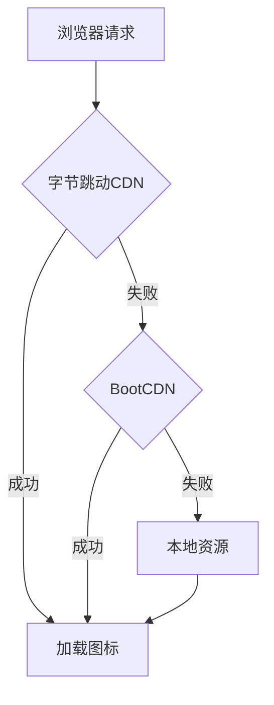

# 开发者文档 - Font Awesome 图标实现

> 面向开发者的技术实现细节和最佳实践

---

## 🏗️ 技术架构

### CDN加载策略



### 文件结构

```
recycle-app/
├── src/
│   ├── index.html                 # CDN配置入口
│   ├── styles.scss               # 本地Font Awesome导入
│   └── app/
│       └── consumer/
│           └── booking-recycle/
│               ├── booking-recycle.html      # 图标HTML
│               ├── booking-recycle.ts        # 图标配置
│               └── booking-recycle.scss      # 图标样式
├── node_modules/
│   └── @fortawesome/
│       └── fontawesome-free@7.0.1/          # 本地备用资源
└── package.json                   # Font Awesome依赖
```

---

## 📦 依赖安装

### 当前版本

```json
{
  "dependencies": {
    "@fortawesome/fontawesome-free": "^7.0.1"
  }
}
```

### 安装命令

```bash
# 安装Font Awesome
npm install @fortawesome/fontawesome-free@7.0.1 --save

# 或使用yarn
yarn add @fortawesome/fontawesome-free@7.0.1
```

---

## 🔧 配置详解

### 1. HTML配置 (`src/index.html`)

```html
<!doctype html>
<html lang="zh-CN">
<head>
  <meta charset="utf-8">
  <title>智回回收 - 环保回收平台</title>
  <base href="/">
  <meta name="viewport" content="width=device-width, initial-scale=1, maximum-scale=1, user-scalable=no">
  
  <!-- 主CDN：字节跳动（国内速度最快） -->
  <link rel="stylesheet" href="https://lf3-cdn-tos.bytecdntp.com/cdn/expire-1-M/font-awesome/6.0.0/css/all.min.css">
  
  <!-- 备用CDN：BootCDN（延迟加载，不阻塞主CDN） -->
  <link rel="stylesheet" href="https://cdn.bootcdn.net/ajax/libs/font-awesome/6.5.1/css/all.min.css" 
        media="none" onload="if(media!='all')media='all'">
</head>
<body>
  <app-root></app-root>
</body>
</html>
```

#### 延迟加载解释

```html
media="none" onload="if(media!='all')media='all'"
```

- `media="none"`: 初始不应用样式，不阻塞页面渲染
- `onload="..."`: 加载完成后将media改为all，应用样式
- 优点：不阻塞主CDN加载，提高页面性能

### 2. SCSS配置 (`src/styles.scss`)

```scss
// Import Font Awesome (local package)
@import '@fortawesome/fontawesome-free/css/all.min.css';
```

#### 作用
- 本地资源作为CDN的备用
- 确保离线环境也能显示图标
- 打包时会被包含在bundle中

---

## 🎨 图标使用

### TypeScript配置 (`booking-recycle.ts`)

```typescript
interface WasteCategory {
  id: string;
  name: string;
  icon: string;  // Font Awesome类名
  active: boolean;
}

wasteCategories: WasteCategory[] = [
  { 
    id: 'paper', 
    name: '纸类', 
    icon: 'fas fa-newspaper',  // ← 完整类名
    active: true 
  },
  { 
    id: 'plastic', 
    name: '塑料', 
    icon: 'fas fa-wine-bottle', 
    active: false 
  },
  // ...
];
```

### HTML使用 (`booking-recycle.html`)

#### 方法1：静态图标

```html
<i class="fas fa-recycle"></i>
```

#### 方法2：动态图标（推荐）

```html
<div class="category-icon">
  <i [class]="category.icon"></i>
</div>
```

#### 方法3：带尺寸的图标

```html
<i class="fas fa-recycle fa-2x"></i>  <!-- 2倍大小 -->
<i class="fas fa-recycle fa-3x"></i>  <!-- 3倍大小 -->
```

### SCSS样式 (`booking-recycle.scss`)

```scss
.category-icon {
  width: 44px;
  height: 44px;
  background: linear-gradient(135deg, #4caf50, #66bb6a);
  border-radius: 12px;
  display: flex;
  align-items: center;
  justify-content: center;
  color: white;
  font-size: 20px;
  transition: all 0.3s ease;
  
  i {
    // Font Awesome图标会自动继承font-size和color
  }
  
  &:hover {
    transform: scale(1.1);
    box-shadow: 0 6px 20px rgba(76, 175, 80, 0.3);
  }
}
```

---

## 🚀 性能优化

### 1. CDN预连接

```html
<link rel="preconnect" href="https://lf3-cdn-tos.bytecdntp.com">
<link rel="dns-prefetch" href="https://cdn.bootcdn.net">
```

### 2. 字体子集化

如果只使用部分图标，可以考虑自定义构建：

```bash
# 使用Font Awesome的子集工具
npm install -g @fortawesome/fontawesome-subset
fontawesome-subset ./subset.config.js
```

### 3. 本地缓存策略

```typescript
// Angular service worker配置 (ngsw-config.json)
{
  "assetGroups": [
    {
      "name": "fonts",
      "installMode": "lazy",
      "resources": {
        "urls": [
          "https://lf3-cdn-tos.bytecdntp.com/**/*.css",
          "https://cdn.bootcdn.net/**/*.css"
        ]
      }
    }
  ]
}
```

---

## 🔍 调试工具

### Chrome DevTools命令

```javascript
// 1. 检查Font Awesome是否加载
console.log(
  window.getComputedStyle(document.querySelector('.fas'))
    .getPropertyValue('font-family')
);
// 应输出: "Font Awesome 6 Free" 或 "Font Awesome 7 Free"

// 2. 列出所有Font Awesome样式表
Array.from(document.styleSheets)
  .filter(sheet => 
    sheet.href && sheet.href.includes('fontawesome') || 
    sheet.href && sheet.href.includes('font-awesome')
  )
  .forEach(sheet => console.log(sheet.href));

// 3. 创建测试图标
const testIcon = document.createElement('i');
testIcon.className = 'fas fa-recycle';
testIcon.style.cssText = 'font-size:50px;color:green;position:fixed;top:10px;right:10px;z-index:9999;';
document.body.appendChild(testIcon);

// 4. 检查图标的content值
console.log(
  window.getComputedStyle(document.querySelector('.fa-recycle'), ':before')
    .getPropertyValue('content')
);
// 应输出: "\f1b8"（回收图标的Unicode）
```

### 自动化测试

```typescript
// booking-recycle.spec.ts
import { ComponentFixture, TestBed } from '@angular/core/testing';
import { BookingRecycle } from './booking-recycle';

describe('BookingRecycle Icons', () => {
  let component: BookingRecycle;
  let fixture: ComponentFixture<BookingRecycle>;

  beforeEach(async () => {
    await TestBed.configureTestingModule({
      imports: [BookingRecycle]
    }).compileComponents();

    fixture = TestBed.createComponent(BookingRecycle);
    component = fixture.componentInstance;
    fixture.detectChanges();
  });

  it('should have all category icons defined', () => {
    component.wasteCategories.forEach(category => {
      expect(category.icon).toBeTruthy();
      expect(category.icon).toMatch(/^fa[srlbdt]\s+fa-/);
    });
  });

  it('should render category icons in template', () => {
    const compiled = fixture.nativeElement;
    const icons = compiled.querySelectorAll('.category-icon i');
    expect(icons.length).toBe(component.wasteCategories.length);
  });
});
```

---

## 📊 图标类型说明

### Font Awesome 类型前缀

| 前缀 | 类型 | 示例 | 说明 |
|------|------|------|------|
| `fas` | Solid | `<i class="fas fa-home"></i>` | 实心图标（最常用）|
| `far` | Regular | `<i class="far fa-heart"></i>` | 空心图标 |
| `fal` | Light | `<i class="fal fa-star"></i>` | 轻量图标（Pro版本）|
| `fat` | Thin | `<i class="fat fa-user"></i>` | 细线图标（Pro版本）|
| `fab` | Brands | `<i class="fab fa-github"></i>` | 品牌图标 |

### 图标动画

```html
<!-- 旋转 -->
<i class="fas fa-spinner fa-spin"></i>

<!-- 脉冲 -->
<i class="fas fa-heart fa-beat"></i>

<!-- 摇晃 -->
<i class="fas fa-bell fa-shake"></i>

<!-- 翻转 -->
<i class="fas fa-shield fa-flip"></i>
```

---

## 🐛 常见问题与解决方案

### 问题1: 图标不显示

```typescript
// 解决方案1: 检查类名
// ❌ 错误
icon: 'fa-recycle'

// ✅ 正确
icon: 'fas fa-recycle'

// 解决方案2: 检查Font Awesome加载
ngOnInit() {
  // 延迟检查，确保CDN有足够时间加载
  setTimeout(() => {
    const testEl = document.createElement('i');
    testEl.className = 'fas fa-recycle';
    testEl.style.display = 'none';
    document.body.appendChild(testEl);
    
    const fontFamily = window.getComputedStyle(testEl).fontFamily;
    if (!fontFamily.includes('Font Awesome')) {
      console.error('Font Awesome 未正确加载');
      // 可以显示错误提示或使用SVG图标作为降级方案
    }
    
    document.body.removeChild(testEl);
  }, 1000);
}
```

### 问题2: 图标闪烁（FOUC）

```scss
// 解决方案: 添加过渡效果
.icon-container {
  i {
    opacity: 0;
    transition: opacity 0.3s ease;
  }
  
  // 当Font Awesome加载后
  &.loaded i {
    opacity: 1;
  }
}
```

```typescript
// 在组件中检测Font Awesome加载
export class BookingRecycle implements OnInit {
  iconsLoaded = false;

  ngOnInit() {
    this.checkFontAwesome();
  }

  checkFontAwesome() {
    const checkInterval = setInterval(() => {
      const testEl = document.createElement('i');
      testEl.className = 'fas fa-recycle';
      testEl.style.display = 'none';
      document.body.appendChild(testEl);
      
      const fontFamily = window.getComputedStyle(testEl).fontFamily;
      document.body.removeChild(testEl);
      
      if (fontFamily.includes('Font Awesome')) {
        this.iconsLoaded = true;
        clearInterval(checkInterval);
      }
    }, 100);
    
    // 超时保护
    setTimeout(() => clearInterval(checkInterval), 5000);
  }
}
```

### 问题3: 打包后图标丢失

```typescript
// angular.json配置
{
  "build": {
    "options": {
      "assets": [
        {
          "glob": "**/*",
          "input": "node_modules/@fortawesome/fontawesome-free/webfonts",
          "output": "/webfonts"
        }
      ]
    }
  }
}
```

---

## 📈 性能监控

### 监控CDN加载时间

```typescript
export class BookingRecycle implements OnInit {
  ngOnInit() {
    this.monitorCDNPerformance();
  }

  monitorCDNPerformance() {
    if ('performance' in window) {
      window.addEventListener('load', () => {
        const resources = performance.getEntriesByType('resource') as PerformanceResourceTiming[];
        
        resources
          .filter(r => r.name.includes('font-awesome') || r.name.includes('fontawesome'))
          .forEach(r => {
            console.log(`CDN加载时间: ${r.name}`);
            console.log(`- 耗时: ${r.duration.toFixed(2)}ms`);
            console.log(`- 大小: ${(r.transferSize / 1024).toFixed(2)}KB`);
          });
      });
    }
  }
}
```

---

## 🔐 安全性考虑

### CSP (Content Security Policy) 配置

```html
<!-- index.html -->
<meta http-equiv="Content-Security-Policy" 
      content="
        default-src 'self';
        style-src 'self' 'unsafe-inline' 
                  https://lf3-cdn-tos.bytecdntp.com 
                  https://cdn.bootcdn.net;
        font-src 'self' data: 
                 https://lf3-cdn-tos.bytecdntp.com 
                 https://cdn.bootcdn.net;
      ">
```

### SRI (Subresource Integrity) 验证

```html
<!-- 为CDN资源添加完整性校验 -->
<link rel="stylesheet" 
      href="https://cdn.bootcdn.net/ajax/libs/font-awesome/6.5.1/css/all.min.css"
      integrity="sha384-..."
      crossorigin="anonymous">
```

---

## 🌐 国际化支持

### 图标语义化

```typescript
// 为图标添加语义化描述
interface IconConfig {
  class: string;
  label: string;
  ariaLabel: string;
}

const icons: IconConfig[] = [
  {
    class: 'fas fa-recycle',
    label: '回收',
    ariaLabel: '点击进行废品回收'
  }
];
```

```html
<!-- 使用aria-label提升无障碍性 -->
<i class="fas fa-recycle" 
   [attr.aria-label]="icon.ariaLabel"
   role="img"></i>
```

---

## 📚 参考资源

### 官方文档
- Font Awesome官网: https://fontawesome.com
- 图标搜索: https://fontawesome.com/search
- 使用指南: https://fontawesome.com/docs

### CDN提供商
- 字节跳动CDN: https://cdn.bytedance.com
- BootCDN: https://www.bootcdn.cn
- jsDelivr: https://www.jsdelivr.com

### 工具推荐
- Font Awesome Subset: https://github.com/omacranger/fontawesome-subset
- IcoMoon: https://icomoon.io（自定义图标字体）

---

## 🎯 最佳实践清单

- [ ] 使用国内CDN确保加载速度
- [ ] 配置CDN降级策略（主CDN → 备用CDN → 本地）
- [ ] 图标类名使用完整格式（如 `fas fa-recycle`）
- [ ] 为图标容器添加固定尺寸
- [ ] 使用CSS过渡避免图标闪烁
- [ ] 添加aria-label提升无障碍性
- [ ] 监控CDN性能
- [ ] 配置CSP安全策略
- [ ] 编写单元测试验证图标配置
- [ ] 提供降级方案（SVG图标）

---

**文档版本**: v1.0  
**最后更新**: 2025-10-17  
**维护者**: Development Team  

**下一步建议**:
1. 配置Service Worker缓存CDN资源
2. 实现图标延迟加载优化首屏性能
3. 添加图标加载失败的降级UI

💡 **Happy Coding!** 💡

